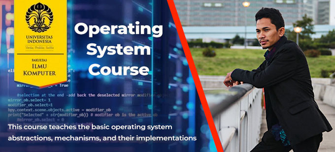

## Welcome to The Abdul Azis Site

A computer science master student who, at the time of the initial deployment of this site, was attending an Operating Systems matriculation course (CSGE602055) at the Faculty of Computer Science, University of Indonesia.

## Background

This site is part of a collective project initiated by [the lecturer](https://github.com/rms46/) of Operating Systems (CSGE602055) course at the Faculty of Computer Science, University of Indonesia for the Even Semester 2019/2020 period.

The author hopes that this site can be used to help participants in the upcoming Operating Systems course to gain additional knowledge.

## Contents

* [Operating Systems URL Starter Pack](URLs/)

* [Operating Systems Lecture Notes](https://os.vlsm.org/)

## Disclaimer

This site is based on shared knowledge. The author never claimed that this was an original work. The contents of this repository is usable, reusable, and modifiable.

[Abdul Azis - OS201 B](mailto:azispro@icloud.com)
